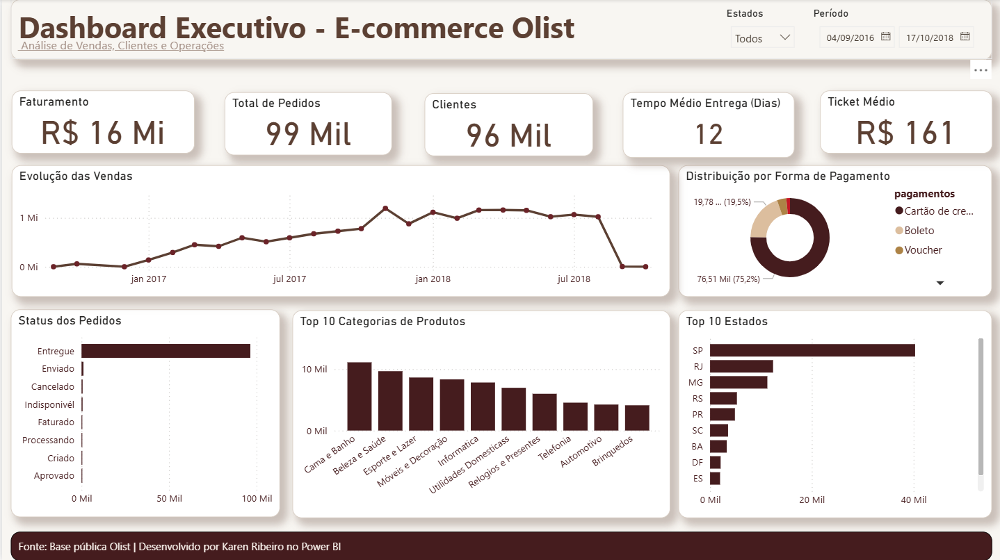
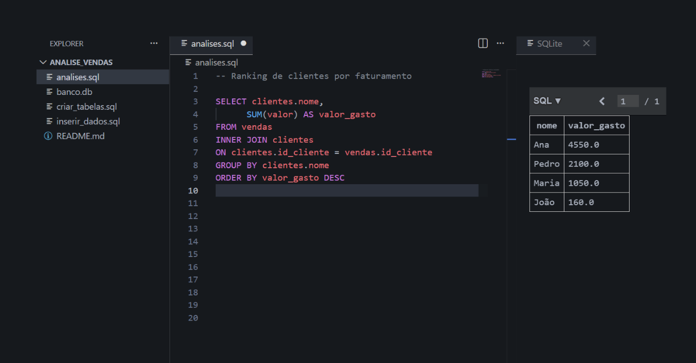
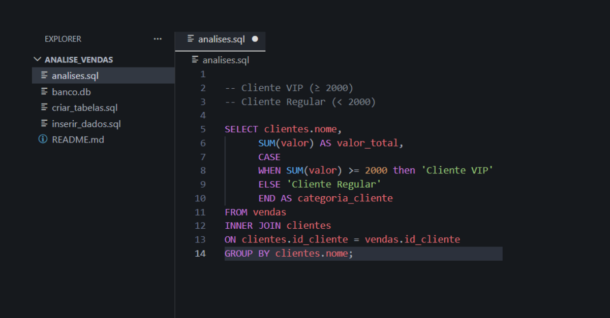

# 📊 Olist Ecommerce Analysis — Power BI

## 📌 Sobre o projeto

Projeto de análise de dados de e-commerce utilizando a base pública da Olist.

O objetivo foi analisar vendas, clientes, pedidos e operações para gerar insights através de um dashboard interativo desenvolvido no Power BI.

---

## 🛠️ Ferramentas utilizadas

- Power BI
- SQL
- SQLite
- Excel / CSV
- GitHub

---

## 📂 Estrutura do projeto

```text
Olist-Ecommerce-Analysis/

├── database/
│   └── olist.db
│
├── images/
│   ├── Dashboard_Olist_Ecommerce.png
│   ├── Consulta_SQL_resultado.png
│   └── Estrutura_do_projeto.png
│
├── sql/
│   ├── 01_criar_tabelas.sql
│   ├── 02_inserir_dados.sql
│   └── 03_analises.sql
│
└── README.md
```

## Dashboard Power BI



---

## Consulta SQL + Resultado



---

## Estrutura do Projeto



# 🔎 Principais análises realizadas

- Evolução das vendas
- Quantidade de pedidos
- Perfil dos clientes
- Produtos mais vendidos
- Análise operacional dos pedidos
- Indicadores de desempenho

---

# 🎯 Objetivo

Transformar dados brutos de e-commerce em informações estratégicas para apoiar tomada de decisão.

---

Projeto desenvolvido para portfólio de análise de dados.
